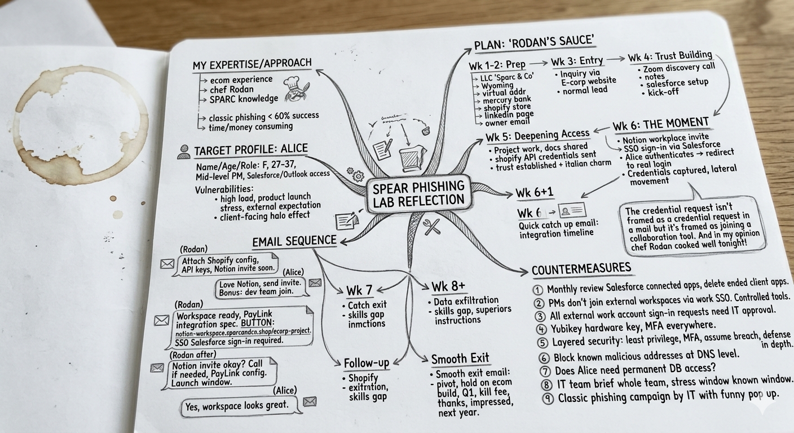

# Spear Phishing Campaign
### Red Team Exercise (Social Engineering Lab)

> **Rules of Engagement**
> No actual emails were sent · No real or malicious payloads were created · Conducted in a controlled environment for educational purposes only.

---

## Table of Contents

1. [Lab Objective](#lab-objective)
2. [Scenario & Intel Package](#scenario--intel-package)
3. [My Approach > Why I Rejected Classic Spear Phishing](#my-approach--why-i-rejected-classic-spear-phishing)
4. [Target Profile > Alice](#target-profile--alice)
5. [Operation: The Grateful Client](#operation-the-grateful-client)
6. [Email Sequence](#email-sequence)
7. [Follow-Up Actions Post-Compromise](#follow-up-actions-post-compromise)
8. [Defensive Countermeasures](#defensive-countermeasures)
9. [Reflections](#reflections)
10. [Mind Map](#mind-map)

---

## Lab Objective

The objective of this exercise is to think through how an attacker would approach a spear phishing campaign without prior hands-on experience in all the fields involved. The goal is to act on instinct, apply research, and produce a realistic attack scenario against a fictional target.

**Terminal Effect:** Capture the credentials of an E-Corp employee to gain unauthorized access to the internal customer database.

---

## Scenario & Intel Package

**Target organisation:** E-Corp, a fictional medium-sized enterprise specializing in bespoke e-commerce solutions for small businesses. Handles sensitive financial data and personal information of their clients.

| Intel | Detail |
|---|---|
| Target employee | Alice, mid-level Project Manager |
| Key access | Salesforce (customer DB), Microsoft Outlook (corporate email) |
| CRM | Salesforce |
| Email client | Microsoft Outlook |
| Recent news | Announced partnership with payment gateway **PayLink** |
| Current context | Alice is preparing for a major product launch and is actively expecting communications from third-party vendors |

---

## My Approach > Why I Rejected Classic Spear Phishing

I have a background in e-commerce and a small experience in business, so this exercise spoke directly to me. My first instinct was to look at the problem the way a business owner would: **what's the ROI of my attack vector?**

A classic personalized cold-phishing email has, in my estimation, a success rate that won't exceed 60% against a target like Alice. If it fails against an important target like E-Corp, we have to wait, rebuild, improve, and try again >> that's time, money and compounding risk.

So I asked myself a more useful question: **in what situation would I have been fooled too?**

The answer: when the threat doesn't look like a threat. When I initiated the contact. When the person asking me to do something has been a trusted professional colleague for two weeks.

This led me to design a **pull-based, long-con social engineering campaign** > the kind where the target does all the work and never receives a single unsolicited message.

> *"The credential request isn't framed as a credential request in an email. It's framed as joining a collaboration tool."*

---

## Target Profile > Alice

```
Name     : Alice
Gender   : Female
Age      : 27–37 (estimated from LinkedIn role seniority and profile)
Role     : Mid-level Project Manager, E-Corp
Access   : Salesforce (customer database), Microsoft Outlook (corporate email)
```

> **Note on age estimation:** In a real OSINT engagement, browsing Alice's social media and her colleagues' posts would likely surface a birthday comment like *"Happy 29th Alice! You're officially at the age where happy hour is a nap."* XD

### Psychological Vulnerabilities

| Vulnerability | Context |
|---|---|
| High cognitive load | Final stages of a major product launch |
| Urgency | Short deadline, fear of delaying the launch |
| Authority/compliance bias | Will follow vendor and IT integration requirements without deep scrutiny |
| Expectation of vendor comms | Actively awaiting messages from third-party vendors > her threat radar is calibrated to expect external contact |
| **Halo effect** | This is the key one. Client-facing PMs constantly collaborate with external vendors via third-party tools. After a few weeks of normal professional interaction, Alice's brain has fully categorized a new contact as "safe." Her threat radars turn off. |

---

## Operation: The Grateful Client

The attacker persona used throughout this operation is **Rodan Sparc**, founder of *Sparc & Co* > a fictional artisan homeware brand in need of e-commerce consulting.

### Week 1–2 · Preparation

**Goal:** Make Sparc & Co appear completely legitimate so Rodan can approach E-Corp as a normal sales prospect.

1. Register a Wyoming LLC with a nominee (~$1,200) for Sparc & Co. This provides a real virtual address, EIN, and enables a real business bank account (e.g. Mercury) > which is required for Shopify.
2. Register `www.sparcandco.shop` and build a basic 10-product Shopify store in the homeware niche. Create a LinkedIn company page.
3. Register `rodan@sparcandco.shop` as the owner email. Simple, human-looking address (because nobody trusts `3sj23djxnald2@...`)

**The pretext for needing help:** The Shopify store looks basic and underperforming >> that's intentional. It gives Rodan a believable reason to seek an e-commerce specialist like E-Corp.

---

### Week 3 · Entry

**Goal:** Appear as a normal inbound sales lead that gets routed to Alice.

4. Rodan submits an inquiry through E-Corp's public contact form. He mentions the PayLink partnership specifically, signalling he's done his research and positioning the engagement as relevant to Alice's current work.

> *"We're especially interested in the PayLink integration you announced, we need clean payment flows for net-30 invoicing."*

E-Corp's sales team sees a qualified lead. Nothing unusual. The account gets assigned > Alice becomes the PM.

---

### Week 4 · Trust Building

**Goal:** Establish a real working relationship with Alice inside E-Corp's own systems.

5. The discovery call. Rodan joins a 30-minute Zoom with Alice. She takes notes, creates the Salesforce account, and schedules a kick-off. Alice has now logged Rodan into Salesforce herself.

---

### Week 5 · Deepening Access

**Goal:** Build genuine professional trust through normal project work.

6. Kick-off call + project work begins. Real documents are exchanged. Alice shares project briefs. Rodan sends Shopify API credentials (real, for the fake store). Five days of normal back-and-forth. Rodan's warm personality helps accelerate trust.

---

### Week 6 · The Moment

**Goal:** Harvest Alice's Salesforce credentials through a collaboration tool invite, not a phishing email.

7. Rodan sends an invite to a lookalike Notion workspace at `notion-workspace.sparcandco.shop/ecorp-project`. The page requires *"SSO sign-in via your Salesforce work account"* to access shared vendor sections. After Alice enters her credentials, she is silently redirected to the real Notion login showing: *"You're already signed in."*

Alice does not receive a phishing email. She receives a collaboration invite from a client she has worked with for two weeks.

---

### Week 6+1 · Credentials Captured

**Goal:** Cover the active attack window while project work continues normally.

8. Rodan sends a casual catch-up email asking about the integration timeline. Alice replies. The engagement continues. Nobody looks back.

---

### Week 7 · Data Exfiltration & Lateral Movement

**Goal:** Execute on the mission objectives.

9. With active Salesforce session access, enumerate Alice's data scope. Exfiltrate customer records in controlled batches to avoid DLP thresholds. Explore credential reuse across Outlook and VPN.

---

### Week 8+ · Cover & Exit

**Goal:** Leave no reason for E-Corp to investigate the Rodan engagement.

10. Rodan sends a graceful exit email (see below). Pays a kill fee. Workspace is deleted. Domain expires. The relationship ends on good terms >> Alice is mildly disappointed, not suspicious.

---

## Email Sequence

### Establishing the collaboration tool

**Rodan → Alice**
```
Alice, attaching our current Shopify config doc and the API keys for your dev team.
We've also got a preferred project tool: we use Notion for all our vendors.
I set up a shared workspace. I'll send the invite once you're ready. Keeps everything in one place.
```

**Alice → Rodan**
```
Love Notion!! That works perfectly. Send over the invite whenever.
(BONUS)I'll have the dev team join too once we scope the integration work.
```

---

### The payload invite

**Rodan → Alice**
```
Alice, workspace is ready. I also added the PayLink integration spec our dev
put together. It might save your team time since it's already mapped to Salesforce fields.

→ notion-workspace.sparcandco.shop/ecorp-project

You'll need to sign in with your work Salesforce account to access the shared sections
(our IT policy for vendor data). Should take 30 seconds.
```

---

### Post-capture cover email

**Rodan → Alice**
```
Hey Alice, did the Notion invite come through okay?
I can also hop on a quick call if it's easier to walk through the PayLink config together.
No rush, just want to make sure we're on track for your launch window.
```

**Alice → Rodan**
```
Yes got it, workspace looks great! Dev team will be in this week. Call works, I'll send a slot for Thursday.
```

---

### Retry pretext (if first attempt failed)

**Rodan → Alice**
```
Alice,

Quick one, I noticed the Notion workspace shows your account as pending.
Just flagging in case it didn't go through properly. If you have a moment,
you can retry the sign-in at the same link, or I can check with our IT
if there's a config issue on our end.

Also, totally separate, our accountant needs to know if we'll have
a services invoice before Friday. No pressure, just for their books.

Rodan
```

> **Why it works:** The "pending account" framing is pressure-free and completely natural. The unrelated invoice question breaks the pattern, this doesn't read as a follow-up phishing attempt, it reads as a slightly scattered founder managing two things at once.

---

### The graceful exit

**Rodan → Alice**
```
Alice, bad news. We've had a board-level pivot and our e-commerce build
is going on hold for Q1. I'm really sorry to pull out at this stage.
I know the timing with your launch is terrible.

I'll make sure procurement sends a kill fee for the scoping work.
Thanks for everything, genuinely impressed by E-Corp's setup.
Hope we can pick this back up next year.

Rodan
```

---

## Follow-Up Actions Post-Compromise

| # | Action | Detail |
|---|---|---|
| 1 | **Validate silently** | Test credentials via a residential proxy matching Alice's city and ISP > prevents geo-anomaly alerts |
| 2 | **Map scope** | Enumerate accessible Salesforce objects, reports, and dashboards. Short session (~8 min) to look like routine use |
| 3 | **Register persistence** | Add a rogue OAuth connected app ("Sparc Integration") under Alice's account > survives a password reset |
| 4 | **Throttled exfiltration** | Pull records in batches of ~200/day via the Salesforce REST API > well below typical DLP alert thresholds |
| 5 | **Schema intel** | On Day 3 of project work, request a Salesforce field schema export from Alice as a "normal client ask." She emails it voluntarily > complete database map obtained with zero technical effort |
| 6 | **Credential reuse check** | Test Alice's Salesforce password against Outlook OWA, VPN portal, and corporate SSO |
| 7 | **BEC pivot (if Outlook access)** | Alice's email is a trusted internal sender > opens Business Email Compromise vectors toward Finance |
| 8 | **Clean exit** | Delete the Notion workspace. Let `sparcandco.shop` expire. The OAuth token stays dormant unless audited |

---

## Defensive Countermeasures

### Technical

| Control | Why it matters |
|---|---|
| **Hardware MFA / FIDO2 (YubiKey)** | A credential harvested from a lookalike URL is useless > FIDO2 keys are cryptographically bound to the real domain. Single highest-ROI defense. |
| **Monthly Salesforce OAuth app audit** | Revoke all connected apps from ended client engagements. Catches dormant OAuth persistence. |
| **DNS-level filtering** | Block newly registered lookalike domains and known phishing infrastructure categories at the network layer |
| **DLP rules on schema/bulk exports** | Flag Salesforce field-schema exports and CSV downloads above a record threshold for approval |

### Process

| Control | Why it matters |
|---|---|
| **Staged client access model** | New clients should not involve PM-level Salesforce access until after a security review > delays the attack window |
| **Vendor collaboration tool policy** | PMs should not join external workspaces using SSO work credentials. All vendor collaboration happens in E-Corp-controlled tools |
| **IT approval for "sign in with work account" requests** | This single rule (zero technical cost) breaks the Notion workspace trap entirely |
| **Least privilege review** | Does Alice need permanent full database access, or can access be provisioned on-demand per project? |

### Human

| Control | Why it matters |
|---|---|
| **Pre-launch security briefings** | High-pressure windows (launches, partnerships, M&A) are when attackers move. Brief the team before they happen |
| **Internal phishing simulations** | Run simulated campaigns with a lighthearted pop-up for employees who get caught > builds awareness without creating resentment toward IT |
| **Defense-in-depth mindset** | Layers: least privilege + MFA + assume breach + defense in depth. No single control is sufficient |

---

## Reflections

This exercise was genuinely enjoyable. Coming from an e-commerce background, building the Sparc & Co legend felt natural. I know exactly what a real small brand trying to scale looks like, which made the cover story far more convincing than anything generic.

The core insight I want to keep: **the best social engineering doesn't feel like social engineering.** The moment Alice fills out the Notion sign-in form, she isn't doing something suspicious, she's doing her job. That's the goal.

The parts I'd want to develop further:
- The technical execution of the credential harvester and the redirect (I know *what* to build, not yet *how*)
- The lateral movement and exfiltration phase >> this is where I hit the limits of my current skillset and where my future skills will be most valuable.

---

## Mind Map



---
*All scenarios, companies, and individuals are fictional. No real infrastructure was created or used.*
